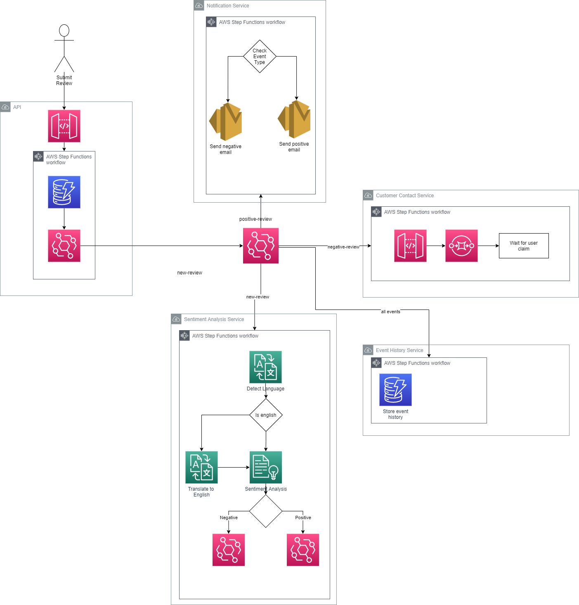

# Event Driven Serverless CDK

This project contains an example of building an AWS native, event driven, customer review analysis application. It uses serverless components and native AWS service integrations. The application is deployed using the AWS CDK, written in C#.

## Architecture



The application consists of 6 services:

### API

A storage first API that receives requests from a front-end, stores them durably and publishes an event to notify other services that a new review has been received.

### Sentiment Analysis

Service to translate the review to English if not currently in English, analyze the review content and detect the sentiment.

### Notification Service

Sends email notifications back to the reviewer.

### Customer Contact Service

Negative reviews are followed up by a customer service representitive. This service manages that customer service flow.

### Event History Service

An audit service, to store all events relating to a given review.

## Deployment

Before you deploy the application you will first need to add the email address to be used for customer service notifications. Ensure that the AWS account you deploy the stack to has permissions to send email to the email address used.

### Add Email

1) Open src/EventDrivenCdk/CustomerContactService/WorkflowStep.cs
2) Add your email address to the AddSubscription line
```
negativeReviewNotification.AddSubscription(new EmailSubscription("", new EmailSubscriptionProps()
```

The entire application can be deployed by running the below command from the root directory.

```
cdk bootstrap
cdk deploy
```